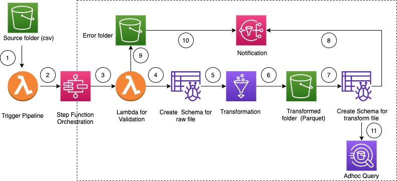

<<<<<<< HEAD
# s3-glue-stepfunctions-etl
A serverless ETL pipeline using AWS S3, Glue, Lambda, and Step Functions. Automates data ingestion, validation, transformation, and orchestration with infrastructure-as-code and modular Lambda functions.
=======
# Serverless ETL Pipeline Orchestrated Using AWS Step Functions

This pattern explain how to build a serverless  ETL pipeline to validate, transform, compress, 
and partition large csv dataset for performance and cost optimization. 
The pipeline is orchestrated by serverless AWS Step Functions with error handling, retry and end user notification.
When a csv file is uploaded to AWS S3 (Simple Storage Service) Bucket source folder, ETL pipeline is triggered. 
The pipeline validates the content and the schema of the source csv file, transform csv file to compressed parquet format, 
partition the dataset with year/month/day  and store in a transformed folder for  analytics tools to consume.

---

## Prerequisites 

* An active AWS account with programmatic access
* AWS CLI with AWS account configuration, so that you can create AWS resources by deploying CloudFormation  stack
* Amazon S3 bucket 
* CSV dataset with correct schema ( attached is a sample csv file with correct schema and data type)
* Web browser
* AWS Glue console access
* AWS Step Functions console access

## Architecture

## High level work flow

1. User uploads a csv file. AWS S3 Notification event triggers a AWS Lambda function 
2. AWS Lambda function starts the step function state machine
3. AWS Lambda function validates the schema and data type of the raw file
4. AWS Glue Crawler create the schema of the raw file and move the file to stage folder
5. AWS Glue job transform, compress and partition the raw file into Parquet format
6. AWS Glue job also move the file to transform folder.
7. AWS Glue Crawler create the schema from the transformed file . The Resulting Schema can be used by analytics job
8. AWS SNS sends successful notification
9. File moved to error folder if validation fails
10. AWS SNS sends error notification for any error inside workflow
11. Amazon Athena used for any adhoc query on partitioned dataset. 

## Repository Structure
- template.yml - CloudFormation template file
- parameter.json - File that contains all the parameters and their respective values. This file needs to be updated to change the parameter value as described below
 - myLayer - This folder contains python packages needed to create the required lambda layer for this project
 - lambda - This folder contains the following lambda function
    - move_file.py - Moves the source dataset to archive/transform/error folder 
    - check_crawler.py - Check the status of AWS Glue crawler. It checks "**RETRYLIMIT**" (configurable environment variable) number of times before it sends a failure message. 
    - start_crawler.py - Start the AWS Glue crawler
    - start_step_function.py - Starts AWS Step Functions.
    - start_codebuild.py - Start AWS CodeBuild Project
    - validation.py - Validates input raw dataset. 
    - s3object.py - Creates required directory structure inside S3 bucket

---
## Sample Workflow Execution and Notification
### Successful Execution

### Failed Execution with input validation error

### Sample Success Notification

{"msg": "File moved to archive/Bank_Transaction.csv", "executionname": "3d16677e-f159-4e42-ac7d-bc1b15b8310d", "status": "SUCCESS"}

### Sample Error Notification
{"msg": "File moved to error/Bank_Transaction_1.csv", "executionname": "47c4bcb8-9689-4a8d-b5f2-6ebec0e4f408", "status": "FAILURE"}

>>>>>>> e9d0351 (Initial commit: Version 1)
